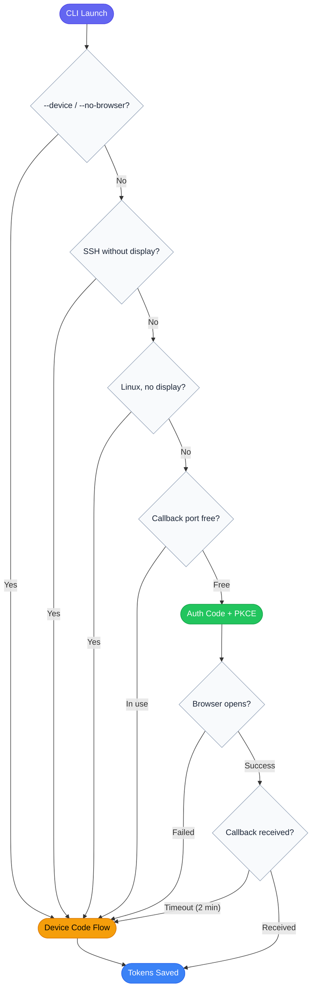

# Authgate CLI

[](https://github.com/go-authgate/cli/actions/workflows/testing.yml)
[](https://github.com/go-authgate/cli/actions/workflows/security.yml)

**A production-ready OAuth 2.0 CLI authentication library for Go.**

Building OAuth 2.0 into a CLI tool means solving the same problems every time: detecting whether a browser is available, implementing PKCE correctly, running a local callback server, caching tokens, handling refresh, and gracefully falling back to a headless device flow for SSH/CI environments. Authgate CLI handles all of this so you can focus on your application logic.

This mirrors the authentication strategy used by **GitHub CLI**, **Azure CLI**, and **Google Cloud SDK** — automatically selecting between Authorization Code Flow with PKCE (browser) and Device Authorization Grant (headless/SSH) based on the runtime environment, with no manual configuration required.

---

## Table of Contents

- [Why This CLI?](#why-this-cli)
- [Quick Start](#quick-start)
- [How It Works](#how-it-works)
- [Configuration](#configuration)
- [Authentication Flows](#authentication-flows)
- [Token Storage](#token-storage)
- [Troubleshooting](#troubleshooting)
- [Development](#development)

---

## Why This CLI?

Without Authgate CLI, every OAuth-enabled CLI tool must implement the same boilerplate:

| If you implement it yourself                                | Authgate CLI handles it for you                         |
| ----------------------------------------------------------- | ------------------------------------------------------- |
| Detect SSH session / headless environment                   | ✅ Auto-selects PKCE or Device Flow                     |
| Generate PKCE `code_verifier` + `code_challenge` (RFC 7636) | ✅ Built-in                                             |
| Spin up a local callback HTTP server                        | ✅ Built-in, bound to `127.0.0.1`                       |
| Add CSRF `state` parameter and validate on callback         | ✅ Built-in                                             |
| Cache tokens to disk with safe file permissions             | ✅ Written as `0600`, multi-client keyed by `CLIENT_ID` |
| Refresh access token silently on expiry                     | ✅ Built-in, with auto-retry on `401`                   |
| Fall back to Device Flow when browser fails or times out    | ✅ Automatic                                            |
| Handle concurrent writes to the token file                  | ✅ File-lock with stale-lock timeout                    |

---

## Quick Start

### Prerequisites

- Go 1.24+
- A running [AuthGate server](../README.md) — get the `CLIENT_ID` UUID from its startup logs

### 1. Configure

```bash
cp .env.example .env
```

Edit `.env` and set at minimum:

```bash
SERVER_URL=http://localhost:8080
CLIENT_ID=<uuid-from-server-logs>   # Required — all other fields have defaults
```

### 2. Run

```bash
go run .
```

The CLI auto-detects your environment and selects the appropriate flow:

- **Local workstation with a browser** → opens a browser tab, completes authorization silently
- **SSH session / no display / CI** → prints a URL and user code for you to authorize from another device

### 3. Build a binary

```bash
make build
# Binary written to bin/cli
./bin/cli
```

---

## How It Works

### System architecture

Authgate CLI sits between your terminal and the AuthGate server. It acquires tokens on your behalf and demonstrates how to use them against a protected resource.

```
┌─────────────────────────────────────────────────────────┐
│  Your Terminal                                          │
│                                                         │
│  ┌────────────┐   OAuth tokens   ┌──────────────────┐  │
│  │ Authgate   │ ◄──────────────► │  AuthGate Server │  │
│  │ CLI        │                  │  (OAuth 2.0 AS)  │  │
│  └─────┬──────┘                  └──────────────────┘  │
│        │                                                │
│        │ Bearer token                                   │
│        ▼                                                │
│  ┌─────────────┐                                        │
│  │  Protected  │                                        │
│  │  Resource   │                                        │
│  └─────────────┘                                        │
└─────────────────────────────────────────────────────────┘
```

### Flow selection

The CLI automatically picks the right OAuth flow based on the runtime environment:



### Token lifecycle

On each run the CLI follows this order:

1. **Load cached tokens** — read from `TOKEN_FILE` keyed by `CLIENT_ID`
2. **Valid access token** — use it directly, skip authentication
3. **Expired access token** — attempt a silent refresh with the refresh token
4. **Expired/missing refresh token** — trigger full re-authentication (browser or device flow)
5. **After any successful auth** — verify token at `/oauth/tokeninfo`, then demonstrate auto-refresh on `401`

---

## Configuration

Configuration is resolved in priority order: **CLI flag → environment variable → default**.

### Environment variables

| Variable        | Default                 | Description                                  |
| --------------- | ----------------------- | -------------------------------------------- |
| `SERVER_URL`    | `http://localhost:8080` | AuthGate server base URL                     |
| `CLIENT_ID`     | _(required)_            | OAuth client ID (UUID from server logs)      |
| `CLIENT_SECRET` | _(empty)_               | Client secret — omit for public/PKCE clients |
| `CALLBACK_PORT` | `8888`                  | Local port for the redirect callback server  |
| `SCOPE`         | `read write`            | Space-separated OAuth scopes                 |
| `TOKEN_FILE`    | `.authgate-tokens.json` | Path to the token cache file                 |

### CLI flags

| Flag              | Env equivalent  | Description                               |
| ----------------- | --------------- | ----------------------------------------- |
| `--server-url`    | `SERVER_URL`    | AuthGate server URL                       |
| `--client-id`     | `CLIENT_ID`     | OAuth client ID                           |
| `--client-secret` | `CLIENT_SECRET` | Client secret (confidential clients only) |
| `--redirect-uri`  | —               | Override computed redirect URI            |
| `--port`          | `CALLBACK_PORT` | Local callback port                       |
| `--scope`         | `SCOPE`         | OAuth scopes                              |
| `--token-file`    | `TOKEN_FILE`    | Token cache file path                     |
| `--device`        | —               | Force Device Code Flow                    |
| `--no-browser`    | —               | Alias for `--device`                      |

### Usage examples

```bash
# Auto-detect flow (default)
./bin/cli

# Force Device Code Flow (useful in scripts or CI)
./bin/cli --device
./bin/cli --no-browser

# Override server and client
./bin/cli --server-url https://auth.example.com --client-id <uuid>

# Use a non-default callback port
./bin/cli --port 9999
```

---

## Authentication Flows

### Authorization Code Flow with PKCE (browser)

Used when a local browser and a free callback port are available. Suitable for developer workstations.

```
=== AuthGate CLI ===
Client mode : public (PKCE)
Server URL  : http://localhost:8080
Client ID   : xxxxxxxx-xxxx-xxxx-xxxx-xxxxxxxxxxxx

Auth method : Authorization Code Flow (browser)
Step 1: Opening browser for authorization...

  http://localhost:8080/oauth/authorize?...

Browser opened. Please complete authorization in your browser.
Step 2: Waiting for callback on http://localhost:8888/callback ...
Authorization code received!
Step 3: Exchanging authorization code for tokens...
Tokens saved to .authgate-tokens.json
```

**Security properties:**

- PKCE (RFC 7636) — prevents authorization code interception
- `state` parameter — CSRF protection on the callback
- Callback server binds to `127.0.0.1` only
- 2-minute timeout; falls back to Device Code Flow automatically

### Device Authorization Grant (headless/SSH)

Used when no browser is available: SSH sessions without display forwarding, Linux servers, CI environments.

```
=== AuthGate CLI ===
Auth method : Device Code Flow (SSH session without display forwarding)
Step 1: Requesting device code...

----------------------------------------
Please open this link to authorize:
http://localhost:8080/device?user_code=ABC-12345

Or visit : http://localhost:8080/device
And enter: ABC-12345
----------------------------------------

Step 2: Waiting for authorization...............
Authorization successful!
Tokens saved to .authgate-tokens.json
```

**Polling behavior:**

- Respects the server-specified polling interval (default 5 s)
- Implements RFC 8628 exponential backoff on `slow_down` (up to 60 s)

### Public vs. confidential clients

| Mode          | `CLIENT_SECRET` | Token exchange        |
| ------------- | --------------- | --------------------- |
| Public (PKCE) | Not set         | Sends `code_verifier` |
| Confidential  | Set             | Sends `client_secret` |

Public/PKCE is the recommended mode for CLI tools.

---

## Token Storage

Tokens are saved to `TOKEN_FILE` (default `.authgate-tokens.json`) and keyed by `CLIENT_ID`, so the same file can hold credentials for multiple clients.

```json
{
  "tokens": {
    "<client-id>": {
      "access_token": "...",
      "refresh_token": "...",
      "token_type": "Bearer",
      "expires_at": "2026-01-01T00:00:00Z",
      "client_id": "<client-id>",
      "flow": "browser"
    }
  }
}
```

The `flow` field records whether `browser` or `device` was used.

**Concurrent write safety:** token writes use a `.lock` file with a 30-second stale-lock timeout, ensuring multiple processes can share the same token file without corruption.

**File permissions:** written as `0600` (owner read/write only).

---

## Troubleshooting

### Port 8888 is already in use

The callback server cannot start, so the CLI falls back to Device Code Flow automatically. To use a different port for PKCE:

```bash
./bin/cli --port 9999
# or
CALLBACK_PORT=9999 ./bin/cli
```

### Browser does not open automatically

The authorization URL is always printed to the terminal. Copy and paste it into a browser manually. The CLI will continue waiting for the callback.

If you are in a headless environment (SSH without display forwarding), use `--device` to skip the browser flow entirely:

```bash
./bin/cli --device
```

### "CLIENT_ID is required" error

The `CLIENT_ID` must be the UUID shown in the AuthGate server startup logs. It is not a value you create — it is assigned by the server when a client is registered.

```bash
# Check your .env
cat .env | grep CLIENT_ID

# Or pass it directly
./bin/cli --client-id xxxxxxxx-xxxx-xxxx-xxxx-xxxxxxxxxxxx
```

### Token refresh fails / kept asking to re-authenticate

If the refresh token has expired, the CLI triggers a full re-authentication. Delete the token cache to start fresh:

```bash
rm .authgate-tokens.json
./bin/cli
```

### Authorization timeout after 2 minutes

The PKCE callback server waits up to 2 minutes for you to complete the browser flow. If it times out, the CLI falls back to Device Code Flow automatically. No action required.

---

## Development

### Prerequisites

```bash
# Install development tools
make install-golangci-lint   # linter
make install-templ           # template code generator (if used)
```

### Common commands

```bash
make build          # Build binary → bin/cli
make test           # Run tests with coverage
make coverage       # Open coverage report in browser
make lint           # Run golangci-lint
make fmt            # Format code
make dev            # Hot reload with air
make clean          # Remove bin/, release/, coverage.txt
make rebuild        # clean + build
```

### Cross-platform builds

```bash
make build_linux_amd64    # Linux x86-64 → release/linux/amd64/cli
make build_linux_arm64    # Linux ARM64  → release/linux/arm64/cli
```
