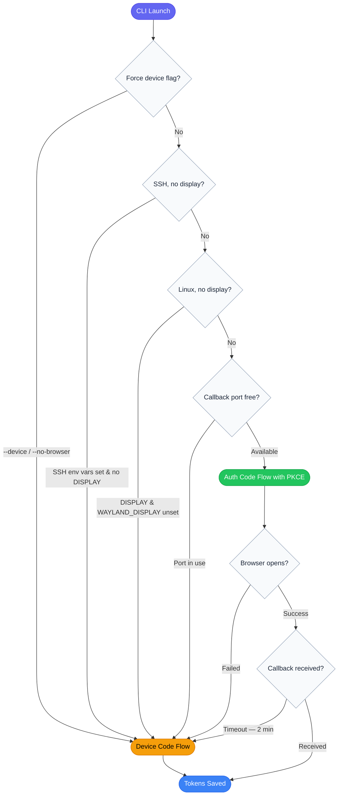

# Authgate CLI

[](https://github.com/go-authgate/cli/actions/workflows/testing.yml)
[](https://github.com/go-authgate/cli/actions/workflows/security.yml)

A CLI example that combines **Authorization Code Flow** (browser-based) and **Device Code Flow** into a single binary. The flow is selected automatically based on the environment — no configuration required.

## How flow selection works



This mirrors how major CLI tools (GitHub CLI, Azure CLI, Google Cloud SDK) handle authentication: browser flow on a local machine, device code flow in SSH/headless/CI environments.

## Prerequisites

- A running AuthGate server (see the repository root)
- The `CLIENT_ID` from the server startup logs

## Quick start

```bash
cp .env.example .env
# Edit .env and set CLIENT_ID

go run .
```

## Usage

```
# Auto-detect (default)
./authgate-hybrid-cli

# Force Device Code Flow
./authgate-hybrid-cli --device
./authgate-hybrid-cli --no-browser

# Override server / client settings
./authgate-hybrid-cli --server-url https://auth.example.com --client-id <uuid>

# Use a different callback port
./authgate-hybrid-cli --port 9999
```

## Environment variables

| Variable        | Default                 | Description                             |
| --------------- | ----------------------- | --------------------------------------- |
| `SERVER_URL`    | `http://localhost:8080` | AuthGate server base URL                |
| `CLIENT_ID`     | _(required)_            | OAuth client ID (UUID from server logs) |
| `CLIENT_SECRET` | _(empty)_               | Client secret (omit for public clients) |
| `CALLBACK_PORT` | `8888`                  | Local port for the redirect server      |
| `SCOPE`         | `read write`            | Space-separated OAuth scopes            |
| `TOKEN_FILE`    | `.authgate-tokens.json` | Token cache file path                   |

## UX examples

**Local machine (browser available):**

```
=== AuthGate Hybrid CLI (Browser + Device Code Flow) ===
Client mode : public (PKCE)
Server URL  : http://localhost:8080
Client ID   : xxxxxxxx-xxxx-xxxx-xxxx-xxxxxxxxxxxx

No existing tokens found, starting authentication flow...
Auth method : Authorization Code Flow (browser)
Step 1: Opening browser for authorization...

  http://localhost:8080/oauth/authorize?...

Browser opened. Please complete authorization in your browser.
Step 2: Waiting for callback on http://localhost:8888/callback ...
Authorization code received!
Step 3: Exchanging authorization code for tokens...
Tokens saved to .authgate-tokens.json
```

**Remote server (SSH session):**

```
=== AuthGate Hybrid CLI (Browser + Device Code Flow) ===
...
Auth method : Device Code Flow (SSH session without display forwarding)
Step 1: Requesting device code...

----------------------------------------
Please open this link to authorize:
http://localhost:8080/device?user_code=ABC-12345

Or visit : http://localhost:8080/device
And enter: ABC-12345
----------------------------------------

Step 2: Waiting for authorization...............
Authorization successful!
Tokens saved to .authgate-tokens.json
```

## Token storage

Tokens are saved to `TOKEN_FILE` (default `.authgate-tokens.json`) and include the `flow` field so you can see which method was used. The file supports multiple clients; each entry is keyed by `client_id`.

On subsequent runs, a valid cached access token is used directly. An expired access token triggers a silent refresh. Only when the refresh token is also expired does the CLI re-authenticate.

## Testing

```bash
go test ./... -v
```
